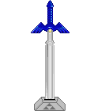

<h1>Olá, meu nome é Richard. Bem-vindo ao meu perfil pessoal! </h1>

<h3>Um pouco sobre mim </h3>

  
Sou graduado em <b>Análise e Desenvolvimento de Sistemas pela FATEC de Ferraz de Vasconcelos</b> e atualmente atuo como desenvolvedor web no INCOR. Nas horas vagas, dedico-me a estudar diversos tópicos relacionados ao desenvolvimento de software, buscando constantemente aprimorar minhas habilidades para contribuir ainda mais para os sistemas nos quais estou envolvido. Além disso, tenho uma paixão por videogames, especialmente RPGs.

<h3>O que estou estudando no momento </h3>

  
 Atualmente, estou imerso no estudo de arquitetura de sistemas, explorando os fundamentos do princípio SOLID. Meu objetivo é dominar esses conceitos para poder desenvolver sistemas que possam facilmente incorporar novas funcionalidades sem introduzir bugs.

<h3>Linguagens que utilizo </h3>

      
  
       

<h3>Contato</h3>

   

 

  <a href="https://github.com/RichardAlves23">
  
  

