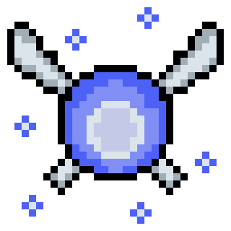

<h1>Olá, meu nome é Richard </h1>

<h3>Um pouco sobre mim </h3>

  
Sou graduado em <b>Análise e Desenvolvimento de Sistemas pela FATEC de Ferraz de Vasconcelos</b> e atualmente atuo como desenvolvedor web no INCOR. Nas horas vagas, dedico-me a estudar diversos tópicos relacionados ao desenvolvimento de software, buscando constantemente aprimorar minhas habilidades para contribuir ainda mais para os sistemas nos quais estou envolvido. Além disso, tenho uma paixão por videogames, especialmente RPGs.

<h3>O que estou estudando no momento </h3>

  
 Atualmente, estou imerso no estudo de arquitetura de sistemas, explorando os fundamentos do princípio SOLID. Meu objetivo é dominar esses conceitos para poder desenvolver sistemas que possam facilmente incorporar novas funcionalidades sem introduzir bugs.

<h3>Ferramentas que utilizo </h3>

  
Tenho habilidades em diversas ferramentas e tecnologias. Em termos de linguagens de programação, possuo experiência em Java, TypeScript e Python. No campo da persistência de dados, estou familiarizado com MySQL e MongoDB. Além disso, possuo conhecimento em frameworks como React e Spring. Também sou capaz de utilizar o ambiente Node com eficiência.

  

        
    
    
    
    
    
    
    

  

              

<h3>Contato</h3>

  
Para entrar em contato comigo sobre assuntos relacionados ao desenvolvimento de software, sinta-se à vontade para clicar no link abaixo. Estou disponível para discutir sobre programação, tecnologias, projetos de software e muito mais.

  

     
  

 

  <a href="https://github.com/RichardAlves23">
  
  

 

   

